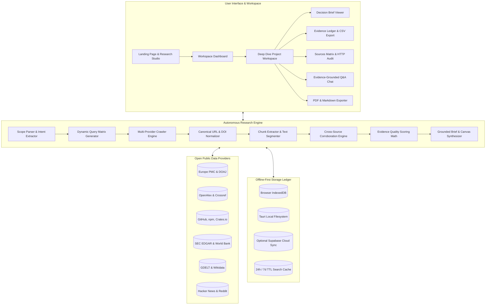
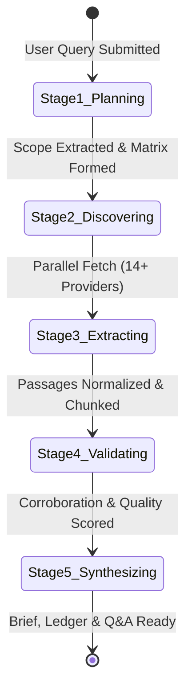

# 🔬 ResearchFlow AI — Evidence-First Local Research Agent & Intelligence Engine

> **Turn complex research inquiries into structured, verifiable, and reusable evidence workspaces.**  
> *100% Local-First • Zero Hallucinations • Zero Paid API Dependencies • Desktop & Web Native*

---

[-black?style=for-the-badge&logo=nextdotjs&logoColor=white)](https://nextjs.org)
[](https://react.dev)
[](https://www.typescriptlang.org)
[](https://tauri.app)
[](https://tailwindcss.com)
[](https://github.com/nagendar0/ResearchFlow-AI)
[](LICENSE)

---

## 📑 Table of Contents

- [Overview](#-overview)
- [Why ResearchFlow AI?](#-why-researchflow-ai)
- [Key Features](#-key-features)
- [System Architecture](#-system-architecture)
- [Autonomous 5-Stage Research Engine](#-autonomous-5-stage-research-engine)
- [5 Specialized Research Categories](#-5-specialized-research-categories)
- [Evidence Scoring & Quality Math](#-evidence-scoring--quality-math)
- [Interactive Workspace Capabilities](#-interactive-workspace-capabilities)
- [Tech Stack & Integrations](#-tech-stack--integrations)
- [Database Schema & Data Model](#-database-schema--data-model)
- [Project Directory Structure](#-project-directory-structure)
- [Getting Started & Installation](#-getting-started--installation)
- [Building Native Desktop Applications](#-building-native-desktop-applications)
- [Running Automated Tests](#-running-automated-tests)
- [Security, Privacy & Local Storage](#-security-privacy--local-storage)
- [Contributing & Community](#-contributing--community)
- [License](#-license)

---

## 🌟 Overview

**ResearchFlow AI** is an evidence-first autonomous research agent and intelligence workspace. Unlike standard LLM chat interfaces that produce generic, ungrounded, or hallucinated summaries, ResearchFlow AI executes a multi-stage scientific pipeline:

1. **Deconstructs** raw user queries into structured research scopes with explicit audience and learning-level calibrations.
2. **Crawls & Indexes** 14+ open scholarly, governmental, technical, and market APIs without requiring paid API keys or subscription tokens.
3. **Extracts & Normalizes** exact textual passages, canonical URLs, and persistent DOIs.
4. **Validates & Corroborates** every claim across independent sources using mathematical quality ranking and cross-source corroboration metrics.
5. **Compiles** actionable, fully cited **Decision Briefs**, interactive **Evidence Ledgers**, and provides an **Evidence-Grounded Q&A Chat** that strictly enforces zero-hallucination guardrails (*grounded refusal when evidence is absent*).
6. **Stores 100% of data on-device** via an offline-first IndexedDB and local filesystem storage engine.

```
   User Query ──► [Scope Extractor] ──► [Parallel Discovery (14+ Endpoints)]
                                                         │
   [Local Ledger] ◄── [Decision Brief & Q&A] ◄── [Corroboration & Scoring Engine]
```

---

## 🎯 Why ResearchFlow AI?

| Challenge with Traditional AI Assistants | ResearchFlow AI Solution |
| :--- | :--- |
| **Hallucinated Citations & Fake DOIs** | Every claim maps to an exact retrieved passage with clickable canonical DOIs/URLs. |
| **Opaque Black-Box Reasoning** | Transparent scoring formula combines relevance, recency, peer-review status, and cross-source corroboration. |
| **Cloud Tracking & Data Harvesting** | 100% Local-first storage (IndexedDB + native OS filesystem). Zero telemetry logs. |
| **Expensive API Keys & Subscriptions** | Keyless architecture leveraging open public indexes (*OpenAlex, Crossref, Europe PMC, SEC, World Bank, etc.*). |
| **Superficial "One-Size-Fits-All" Output** | 5 category-specific engines tailored for Academic, Tech Docs, Market Intel, Idea Validation, and Generalist lookups. |
| **Unreliable Speculative Answers** | Strict Grounded Refusal: returns *"I do not know based on the available evidence..."* when proof is insufficient. |

---

## ✨ Key Features

### 🛡️ 1. 100% Local-First & Private
- All research projects, crawled evidence passages, synthesized briefs, audit logs, and Q&A chat histories are persisted strictly inside your browser's IndexedDB and local file storage.
- Includes a 1-click **Danger Zone Factory Reset** in Profile Settings to purge cached queries and project workspaces instantly.

### 📚 2. Multi-Source Public Index Aggregation (Zero API Keys)
- Built-in multi-threaded adapters query 14+ public endpoints in parallel with timeout safeguards and rate-limit fallbacks:
  - **Academic:** Europe PMC, OpenAlex, Crossref, DOAJ, Open Library.
  - **Technical:** GitHub API, npm Registry, Crates.io, Stack Overflow, Dev.to.
  - **Market & Financial:** SEC EDGAR Tickers, World Bank Open Data, GDELT Global Event Database.
  - **Community & Ideation:** Hacker News Algolia, Reddit Search.
  - **Knowledge Bases:** Wikidata Entity Engine, Wikipedia, Wikinews.

### 🔬 3. Transparent Evidence Quality Matrix
- Transparent mathematical quality scoring on a `0.0 – 5.0+` scale.
- Automatic classification into 4 semantic evidence tiers:
  - 🟢 **High-quality evidence** (Score $\ge$ 4.0)
  - 🔵 **Supporting evidence** (Score $\ge$ 2.5)
  - 🟡 **Limited evidence** (Score $\ge$ 1.0)
  - 🔴 **Conflicting evidence** (Identified multi-source contradictions)

### 📊 4. Interactive Deep-Dive Workspace
- **Decision Brief**: Formatted executive takeaway, domain-specific canvas sections, structured scope table, inline citation tooltips, and copy/export controls.
- **Evidence Ledger**: Granular passage inspector with support badges, keyword relevance highlights, locators, and CSV export.
- **Sources Matrix**: Real-time table displaying HTTP status codes, provider tiers, latency metrics, and direct link resolution.
- **Explain / Q&A Assistant**: Grounded question answering chat interface that searches loaded evidence chunks and cites exact source passages.
- **Live Pipeline Audit Trace**: Step-by-step progress monitor displaying real-time execution logs from planning to final synthesis.

### 📄 5. Professional Multi-Format Export
- **PDF Export**: Generate publication-ready, clean PDF reports with complete citation tables via `jspdf`.
- **Markdown Export**: One-click download of raw decision briefs.
- **Evidence Ledger CSV**: Export structured evidence chunks for downstream data analysis in Excel or Python.
- **JSON Workspace Backup**: Full export and re-import of project databases.

### 🖥️ 6. Native Desktop & PWA Support
- Native 64-bit desktop application for **Windows**, **macOS**, and **Linux** powered by **Tauri v2** and Rust.
- Full offline Progressive Web App (PWA) capabilities with service workers and local caching.

---

## 🏗️ System Architecture



---

## ⚙️ Autonomous 5-Stage Research Engine

ResearchFlow AI executes a deterministic, verifiable 5-stage lifecycle for every inquiry:



### Stage 1: Planning & Scope Extraction
- Parses learning level: `beginner`, `intermediate`, or `advanced`.
- Extracts intended audience (e.g., *"first-year student"*, *"senior engineer"*, *"product manager"*).
- Cleans query prefixes and isolates primary topic from research goals.
- Generates 3 domain-tailored search queries: Core Topic, Target Domain/Application, and Mechanism/Context.

### Stage 2: Parallel Discovery & Source Crawling
- Dispatches concurrent HTTP requests across primary and fallback provider endpoints with 4500ms timeout safeguards.
- Implements graceful error recovery: converts `429 Rate Limit` or timeout events into diagnostic status indicators without failing the pipeline.

### Stage 3: Passage Extraction & Normalization
- Cleans HTML markup, escapes entities, and normalizes whitespaces.
- Reconstructs inverted abstract indexes (e.g., OpenAlex).
- Extracts and binds persistent DOIs (`10.xxxx/...`) and canonical URLs.
- Executes deduplication across URLs, DOIs, and normalized publisher keys.

### Stage 4: Validation, Corroboration & Quality Scoring
- Compares text passages across independent sources to compute n-gram cross-corroboration counters.
- Computes mathematical quality scores based on relevance, source authority, recency (2024–2026 weighting), and passage usability.
- Assigns semantic confidence labels: `High-quality`, `Supporting`, `Limited`, or `Conflicting`.

### Stage 5: Grounded Synthesis & Decision Brief Generation
- Assembles domain-specific decision briefs formatted in structured Markdown.
- Generates inline hyperlinked citations (`[1]`, `[2]`, etc.) linked to source metadata.
- Implements **Grounded Refusal**: If zero verified passages pass threshold filtering, outputs an explicit refusal notice preventing artificial fabrications.

---

## 🎯 5 Specialized Research Categories

ResearchFlow AI dynamically configures its search queries, source priorities, and brief templates based on the selected category:

| Category | Primary Data Providers | Fallback Data Providers | Custom Brief Template Sections |
| :--- | :--- | :--- | :--- |
| 🎓 **Academic Review** | Europe PMC, OpenAlex, Crossref, DOAJ | Open Library, Wikipedia | Structured Methodology, Experimental Evidence, Peer Consensus, Gaps & Uncertainties |
| 💻 **Technical Docs** | GitHub API, npm Registry, Crates.io, Wikidata | Wikipedia, Stack Overflow, Dev.to | Architecture Overview, Official APIs/SDKs, Setup & Installation, Best Practices & Security |
| 📊 **Market Intelligence** | SEC EDGAR Tickers, World Bank, GDELT, Wikidata | Wikipedia, OpenAlex, Wikinews | Market Landscape, Regulatory & SEC Filings, Statistical Indicators, Trends & Competitors |
| 💡 **Idea Validation** | Hacker News Algolia, GitHub, Reddit Search | Wikipedia, OpenAlex, Wikinews | Competitor Matrix, Demand Signals, User Pain Points, Monetization Evidence, **Build/Pivot Recommendation** |
| 🌐 **Generalist Reference** | OpenAlex, Crossref, Europe PMC, Wikidata | Wikipedia, Open Library | Executive Overview, Foundational Definitions, Multi-Angle Breakdown, Reference Sources |

---

## 📐 Evidence Scoring & Quality Math

The evidence ranking engine scores every extracted chunk using a multi-variable transparent formula:

$$\text{Total Score} = S_{\text{domain}} + S_{\text{authority}} + S_{\text{relevance}} + S_{\text{recency}} + S_{\text{usability}} + S_{\text{corroboration}}$$

### Scoring Parameters

1. **Domain Weight ($S_{\text{domain}}$)**:
   - *Technical Docs*: Official documentation / GitHub (+2.5 to +4.0), academic papers penalized (-2.0).
   - *Market Intelligence*: SEC EDGAR / World Bank (+4.0), generic academic papers penalized (-3.0).
   - *Idea Validation*: Direct signals / GitHub / Hacker News (+3.5), academic papers penalized (-2.5).
   - *Academic Review*: Peer-reviewed publications matching concept & domain (+3.5).
2. **Authority Weight ($S_{\text{authority}}$)**:
   - Peer-reviewed journals, official government registries, and nature/ieee/springer indexes: `+1.5`
   - Community forums, blogs, and general web entries: `+0.5`
3. **Topic Relevance ($S_{\text{relevance}}$)**:
   - Calculated by matching multi-word query tokens against the chunk text, capped at `+2.0`.
4. **Recency ($S_{\text{recency}}$)**:
   - Publications indexed within the last 2 years (2024–2026): `+0.5`
5. **Excerpt Usability ($S_{\text{usability}}$)**:
   - Comprehensive excerpts ($>80$ characters): `+0.5`
6. **Cross-Source Corroboration ($S_{\text{corroboration}}$)**:
   - Independent verification across distinct publishers: $\min(\text{Corroboration Count} \times 0.3, 1.0)$

---

## 💻 Interactive Workspace Capabilities

```
┌──────────────────────────────────────────────────────────────────────────────┐
│  ResearchFlow AI — Project: Quantum Computing for Beginners                  │
├──────────────────────────────────────────────────────────────────────────────┤
│  [ Decision Brief ]  [ Evidence Ledger ]  [ Sources Matrix ]  [ Q&A Assistant ]│
├──────────────────────────────────────────────────────────────────────────────┤
│  ## Executive Summary                                                        │
│  Quantum computing leverages superposition and entanglement to solve... [1]  │
│                                                                              │
│  ## Research Scope                                                           │
│  • Audience: First-year student  • Level: Beginner  • Category: Academic     │
│                                                                              │
│  ## Evidence Citations                                                       │
│  [1] OpenAlex: Superposition in Qubits (DOI: 10.1038/s41586-024-xxxx)        │
│  [2] Europe PMC: Quantum Error Correction Benchmarks 2025                    │
│                                                                              │
│  [ 📥 Export PDF ]  [ 📋 Copy Markdown ]  [ 💾 Export CSV ]                   │
└──────────────────────────────────────────────────────────────────────────────┘
```

### 1. Decision Brief Viewer
- Real-time Markdown rendering with typography styled in `Newsreader` and `Inter`.
- Interactive citation pills (`[1]`, `[2]`) with hover tooltips revealing publisher, year, DOI, and quality score.
- Idea Validation canvas automatically derives a dynamic verdict: **Build**, **Validate Further**, **Pivot**, or **Avoid**.

### 2. Evidence Ledger
- Full tabular breakdown of all retrieved passages with quality indicators.
- Filter by support status (`Strongly supported`, `Supported`, `Limited`, `Conflicting`).
- Keyword search across extracted text and locators.
- One-click export to CSV for auditing.

### 3. Sources Matrix & HTTP Audit
- Transparent audit table displaying provider names, source URLs, publication dates, and HTTP response statuses (`success`, `rate_limit`, `timeout`, `error`).

### 4. Evidence-Grounded Q&A Chat
- Ask natural language questions against the workspace.
- Detects user intent (`BEGINNER_EXPLANATION`, `COMPARISON`, `TRUST_EXPLANATION`, `SOURCE_ATTRIBUTION`).
- Retrieves matching evidence chunks and includes inline citation chips linking to original sources.

---

## 🛠️ Tech Stack & Integrations

| Subsystem | Technology | Purpose |
| :--- | :--- | :--- |
| **Frontend Framework** | [Next.js 16](https://nextjs.org/) (App Router, Turbopack) | Modern React 19 server/client hybrid architecture. |
| **Language** | [TypeScript 5](https://www.typescriptlang.org/) | End-to-end type safety across engine, UI, and storage. |
| **Styling** | [TailwindCSS v4](https://tailwindcss.com/) | High-performance utility-first design system. |
| **Desktop Container** | [Tauri v2](https://tauri.app/) (Rust) | Ultra-lightweight native desktop app runtime (under 15MB binary). |
| **Local Storage** | Browser IndexedDB & Local FS Ledger | 100% On-device, offline-first persistence with TTL cache engine. |
| **Cloud Sync (Optional)** | [Supabase](https://supabase.com/) (`@supabase/supabase-js`) | Optional multi-device project synchronization with Row Level Security. |
| **Document Generation** | [jsPDF](https://github.com/parallax/jsPDF) | Client-side, vector-crisp PDF decision brief generation. |
| **Icons & Typography** | Lucide React, Google Fonts (Inter & Newsreader) | Refined visual aesthetics and readability. |

---

## 🗄️ Database Schema & Data Model

ResearchFlow AI operates identically over its local IndexedDB stores and optional Supabase backend. The database architecture is defined in [`schema.sql`](file:///c:/Users/nagen/ResearchFlow%20AI/schema.sql):

```sql
-- 1. PROJECTS TABLE
CREATE TABLE projects (
  id UUID PRIMARY KEY DEFAULT uuid_generate_v4(),
  title TEXT NOT NULL,
  question TEXT NOT NULL,
  status TEXT NOT NULL DEFAULT 'idle', -- idle, planning, discovering, extracting, validating, synthesizing, complete, failed
  audience TEXT DEFAULT 'General',
  depth TEXT DEFAULT 'Standard',
  source_policy TEXT DEFAULT 'Default',
  category TEXT DEFAULT 'generalist',
  created_at TIMESTAMP WITH TIME ZONE DEFAULT CURRENT_TIMESTAMP NOT NULL
);

-- 2. SOURCES TABLE
CREATE TABLE sources (
  id UUID PRIMARY KEY DEFAULT uuid_generate_v4(),
  project_id UUID NOT NULL REFERENCES projects(id) ON DELETE CASCADE,
  url TEXT,
  title TEXT NOT NULL,
  publisher TEXT,
  type TEXT DEFAULT 'web', -- paper, report, gov, web, user_pdf
  published_at TEXT,
  accessed_at TEXT,
  rank INTEGER,
  quality_score NUMERIC DEFAULT 1.0,
  created_at TIMESTAMP WITH TIME ZONE DEFAULT CURRENT_TIMESTAMP NOT NULL
);

-- 3. EVIDENCE CHUNKS TABLE
CREATE TABLE evidence_chunks (
  id UUID PRIMARY KEY DEFAULT uuid_generate_v4(),
  source_id UUID NOT NULL REFERENCES sources(id) ON DELETE CASCADE,
  project_id UUID NOT NULL REFERENCES projects(id) ON DELETE CASCADE,
  text TEXT NOT NULL,
  locator TEXT, -- page number, section, paragraph index
  support_label TEXT DEFAULT 'Supported', -- Strongly supported, Supported, Limited evidence, Conflicting evidence
  quality_signals JSONB, -- recency, relevance, extraction quality
  created_at TIMESTAMP WITH TIME ZONE DEFAULT CURRENT_TIMESTAMP NOT NULL
);

-- 4. REPORTS TABLE
CREATE TABLE reports (
  id UUID PRIMARY KEY DEFAULT uuid_generate_v4(),
  project_id UUID NOT NULL REFERENCES projects(id) ON DELETE CASCADE,
  markdown TEXT NOT NULL,
  executive_takeaway TEXT,
  evidence_count INTEGER DEFAULT 0,
  source_count INTEGER DEFAULT 0,
  created_at TIMESTAMP WITH TIME ZONE DEFAULT CURRENT_TIMESTAMP NOT NULL
);

-- 5. EXPLAIN MESSAGES TABLE (Q&A History)
CREATE TABLE explain_messages (
  id UUID PRIMARY KEY DEFAULT uuid_generate_v4(),
  project_id UUID NOT NULL REFERENCES projects(id) ON DELETE CASCADE,
  question TEXT NOT NULL,
  answer TEXT NOT NULL,
  source_state TEXT DEFAULT 'From report',
  citations JSONB DEFAULT '[]'::jsonb,
  created_at TIMESTAMP WITH TIME ZONE DEFAULT CURRENT_TIMESTAMP NOT NULL
);
```

---

## 📂 Project Directory Structure

```
ResearchFlow-AI/
├── src/
│   ├── app/
│   │   ├── globals.css                # Tailwind CSS v4 & custom design tokens
│   │   ├── layout.tsx                 # Root layout with fonts & metadata
│   │   ├── page.tsx                   # Main Landing Page & Feature Showcase
│   │   ├── landing/                   # Interactive Product Landing Experience
│   │   │   └── page.tsx
│   │   ├── workspace/                 # Multi-Project Workspace Dashboard
│   │   │   └── page.tsx
│   │   └── project/                   # Deep-Dive Evidence Workspace
│   │       ├── page.tsx               # Next.js Page wrapper
│   │       └── ClientWorkspace.tsx    # 4-Tab Workspace (Brief, Ledger, Matrix, Q&A)
│   ├── components/
│   │   ├── DownloadModal.tsx          # Multi-OS Desktop installer download modal
│   │   ├── ProfileModal.tsx           # Profile settings & Danger Zone factory reset
│   │   └── WelcomeOnboardingModal.tsx # First-time user interactive walkthrough
│   └── lib/
│       ├── engine.ts                  # 14+ Adapters, Ranking Math, Scope Parser, Brief Generator
│       ├── engine.test.ts             # Unit & integration test suite (Node Test Runner)
│       ├── localDb.ts                 # IndexedDB & Tauri FS offline-first storage ledger
│       ├── monitor.ts                 # Enterprise audit logger & confidence test suite
│       └── supabase.ts                # Supabase client & optional cloud synchronizer
├── src-tauri/                         # Tauri v2 64-bit Desktop Runtime
│   ├── Cargo.toml                     # Rust dependencies & crate configuration
│   ├── tauri.conf.json                # Desktop window & bundle configuration
│   └── src/main.rs                    # Native OS filesystem bindings
├── public/                            # Static assets, icons, and PWA manifest
├── package.json                       # Next.js 16, React 19, TypeScript dependencies
├── schema.sql                         # SQL database schema with RLS policies
└── tsconfig.json                      # Strict TypeScript compilation config
```

---

## 🚀 Getting Started & Installation

### Prerequisites
- [Node.js](https://nodejs.org/) v18.0.0 or higher
- [npm](https://www.npmjs.com/) or [yarn](https://yarnpkg.com/) / [pnpm](https://pnpm.io/)
- *(Optional for Desktop builds)* [Rust & Cargo](https://rustup.rs/)

### 1. Clone the Repository
```bash
git clone https://github.com/nagendar0/ResearchFlow-AI.git
cd ResearchFlow-AI
```

### 2. Install Dependencies
```bash
npm install
```

### 3. Run Development Server
```bash
npm run dev
```
Open [http://localhost:3000](http://localhost:3000) in your browser.

### 4. Build Web Production Bundle
```bash
npm run build
npm run start
```

---

## 🖥️ Building Native Desktop Applications

ResearchFlow AI uses **Tauri v2** to compile ultra-lightweight, secure native binaries with direct local filesystem access:

### Prerequisites for Desktop Builds
- Install Rust via [rustup.rs](https://rustup.rs/).
- **Windows**: Visual Studio C++ Build Tools & WebView2.
- **macOS**: Xcode Command Line Tools.
- **Linux**: `libwebkit2gtk-4.1-dev`, `build-essential`, `curl`, `wget`, `file`, `libssl-dev`, `libgtk-3-dev`.

### Build Commands

```bash
# Run Tauri desktop app in development mode
npm run tauri dev

# Compile production desktop installers
npm run build:desktop
```

Compiled binaries will be generated under `src-tauri/target/release/bundle/`:
- **Windows**: `.msi` and `.exe` installers
- **macOS**: `.dmg` and `.app` bundles (Apple Silicon & Intel)
- **Linux**: `.deb` and `.AppImage` packages

---

## 🧪 Running Automated Tests

ResearchFlow AI includes an automated test suite verifying deduplication, scope parsing, category weights, quality ranking, and grounded refusal:

```bash
# Run core engine tests
npm test
```

### Tested Capabilities:
- ✅ **Deduplication & Canonical URL Normalization** (UTM removal, trailing slashes, protocol unification).
- ✅ **DOI Resolution & Prioritization** (Matches variations of `10.xxxx/...` and selects highest quality tier).
- ✅ **Audience & Learning-Level Extraction** (Accurate parsing of beginner, intermediate, and advanced prompts).
- ✅ **Evidence Scoring Math & Thresholding** (Recency, peer review, and keyword relevance weight verification).
- ✅ **Idea Validation Verdict Engine** (Verifies `Build`, `Validate Further`, `Pivot`, and `Avoid` decision trees).
- ✅ **Enterprise Zero-Hallucination Guardrails** (Ensures unsupported queries trigger grounded refusals).

---

## 🔒 Security, Privacy & Local Storage

- **100% On-Device Data**: Queries, retrieved papers, decision briefs, and chat histories are never transmitted to any central analytics server.
- **Direct Public API Invocations**: Only derived search keywords are sent to public indexes (*Europe PMC, OpenAlex, etc.*).
- **TTL Cache Invalidation**: Caches queries with 24-hour and 7-day expiration windows to conserve local memory.
- **Danger Zone Factory Reset**: Profile modal contains an instant local data purge to wipe all project databases and cache tables.

---

## 🤝 Contributing & Community

Contributions are welcome! If you would like to contribute:

1. **Fork the Repository**
2. **Create a Feature Branch** (`git checkout -b feature/NewPublicProvider`)
3. **Commit your Changes** (`git commit -m "Add ArXiv adapter to Academic category"`)
4. **Push to the Branch** (`git push origin feature/NewPublicProvider`)
5. **Open a Pull Request**

---

## 📜 License

Distributed under the **MIT License**. See `LICENSE` for more information.

Developed with ❤️ by [nagendar0](https://github.com/nagendar0) & the open-source community.  
Repository: [https://github.com/nagendar0/ResearchFlow-AI](https://github.com/nagendar0/ResearchFlow-AI)
